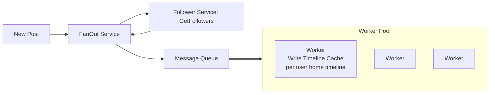

<!--BODY-->
> 前面寫的 [System Design: Scalability](https://aryido.github.io/posts/backend-system/scaling-database/)講述了如何擴展 DB 來承擔流量，接下來要討論如何去設計系統來提高效能 (Performance)，延遲的影響對於使用者體驗也是一件需要注意的重要事情，主要是使用兩個衡量指標爲：延遲度 (latency) 與吞吐量 (throughput)。理想的狀況來說，低延遲與高吞吐 (low latency and high throughput) 是軟體系統設計的主要目標，而 latency 主要是受到兩大因素影響：
> - 運算時間
> - 傳輸時間
> 
> 常用的解決套路是使用 cache 機制，以下繼續說明。
<!--more-->

---

# Latency 延遲

Latency: 指「**請求進到系統到系統回應的這段時間**」，延遲越低會越好，可進一步拆分成：
- 傳輸延遲 Transmission Delay : 請求進來  server 前的網路延遲 
- 排隊延遲 Queuing Delay : 排在 queue 上等待被處理
- 處理延遲 Processing Delay : 在 server 內真正被處理
- 回應延遲 Response Delay : 回傳又會再有網路傳輸的時間

在衡量 Latency 時，盡量**不要單單只有使用平均時間**來衡量，現在是經常使用**中位數**與**百分位**來衡量。例如
- **中位數 (俗稱 p50)** 是 200 毫秒，就代表有一半的請求超過 200 毫秒才完成回應
- 如果**第 95 百分位 (俗稱 p95)** 是 1.5 秒，就能夠看出有 5% 的請求超過 1.5 秒才獲得回應。

對於使用者千萬量級以上軟體系統，即使 5% 也超過 50 萬，數量上相當可觀，稱 Tail Latency Problem ，故用百分位數就能讓軟體團隊去照顧到後面這一塊


測量延遲常用的 APM (Application Performance Monitoring) 工具：
- 直接 Ping： 向伺服器發送資料包並測量往返時間(Round Trip Time RTT)
- Prometheus(收集指標)、Grafana(展示指標) 

降低延遲的方法 Method to Reduce Latency:
- 使用 CDN 將資料更靠近使用者
- 使用 Cache : 透過從記憶體拿取資料，而不用重新計算，對 read heavy 的系统特别有用
- Optimize database queries
- Parallelism 並行化


傳輸時間大大受限於物理定律，即便用光速來傳送資料，從地球一端傳到另一端也需要 0.06 秒的時間，如果再加上 TCP handshake 之類的可能就得花上好幾秒的時間，因此在世界各地都撒滿某種形式的 cache ，如此一來地球上任一點都能就近取用，稱這種特殊的 cache 叫做 Content Delivery Network，簡稱 CDN。

一個跨越全球的請求，傳輸資料所花費的時間，很容易超過處理資料所花費的時間，所以使用 CDN 將資料儲存在靠近使用者的位置，大部分時候比優化應用程式 code 更能有效降低延遲。


# Throughput 吞吐量

Throughput: 指某個系統每秒鐘能處理多少請求或資料，理想上越高會越好，可進一步拆分成：
- 網路吞吐量 Network Throughput： 在給定時間內透過網路傳輸的資料量；用於衡量網路效能
- 磁碟吞吐量 Disk Throughput： 從儲存裝置（例如 SSD/HDD）讀取或寫入資料的速度
- 處理吞吐量 Processing Throughput： worker 單位時間內可以完成的作業或任務數量

提高吞吐量的方法 Methods to Improve Throughput :
- Load Balancing:  將流量分配到多個伺服器上，以避免過載並提高效能
- Queuing: 引入 Queue 可以提高吞吐量，但會增加回應時間
- 使用 Cache : 透過減少後端系統的負載來提高吞吐量


在實務上 Latency 延遲 & Throughput 吞吐量 都詳細再拆解是很有幫助的。當今天請求回應變慢，可以立即看出是哪一段不尋常，加速找出問題所在


---

# 使用 FanOut Service 來減少 Latency 

舉例來說 Twitter 使用者開啟刷新主頁後會展示 user 所關注的人的文章，這代表 Requests 會透過 Loadbalancer 到達 Timeline Service，接下來會進行獲取文章列表的操作：
- 去找到所有自己 follow 的人
- 到資料庫去讀自己 follow 人的文章
- 因為系統已經設計了基於 post_id 來 sharding 文章並儲存在對應的 DB，這樣導致需要**讀取多個** DB，每個資料庫都只能找到一小部分的文章，根據時間進行排序
- 多個資料庫的文章，會在 Service 中再次進行一個合併和排序，將最終的結果傳回

這種做法會必定會導致比較高的 Latency ，常見解決方式是引入 Caching ，**事先存好**要展示給每個使用者的 Timeline，這樣 Timeline Service 就可以直接透過 query cache 找到 Timeline 回傳給這個 user。那更新 cache 當中的 Timeline 時機在何時呢？**會在發布新貼文的時候來更新**，這個組件就稱爲「**FanOut service**」



比如說有一個 User 在 12 點的時候發布了一貼文，觸發 FanOut Service 把一個 Event 傳到 queue 內，然後 pool 內的 worker 會 Async 處理 Task，任務是更新 user 它的每個 follower 的 Timeline Cache，而 Worker Pool 裡面的 Worker 數量可以根據 Message Queue 的積壓情況去動態去調整。

由於使用了非同步 worker 來做事，故可能有些 follower 過了五秒被更新 ; 有的 follower 過了三秒被更新 ; 有的 follower 可能需要等 30 秒...，在沒有錯誤的情況下，「**最終**」 所有 follower 都可以看到新發的貼文，稍微慢個幾分鐘都是能接受的，這個也稱為 「**Eventual Consistency**」。


使用 Message Queue 異步處理寫入 Timeline Cache 在這個例子是能接受的，對於 follow 的人的新增貼文，可以不用第一秒鐘就刷到別人發出來的文章，能容許幾分鐘內出現就好


FanOut service 雖然有兩種模式 **Push Mode** 和**Pull Mode**，但在實際情形下，都是採取**混合模型**，比如說：
- ##### 對於一般用戶：發文的時候，採取一個 push 的推播模型:

  自己在發文章進行寫入的時候，會主動去訪問自己所有的 follower ，並修改他們的 timeline caching，這模式優點在於產生 timeline 的速度一定是最快的。缺點是當 follower 很多，寫入會被放大很多倍，會產生一個 HotSpot 。

  這裡還可以多個優化，因為並不是所有帳號都是活躍的帳號，它可能根本就不會再登入了，如果發現用戶超過一定時間沒有登入，可以不用為它建造 Cache，避免造成資源浪費。

- ##### 多粉絲大帳號：發文的時候，採取 pull 的拉取模型:

  自己在讀取的時候，再去找自己 follow 的人，再去獲取這個 post，這對於已經不活躍的帳號，是不消耗資源的，但產生 Timeline 是在登入後才開始計算，故會有比較顯著的 latency ，並且如果關注用戶太多的話，會進一步影響效能。

---

### 參考資料

- [Latency and Throughput in System Design](https://www.geeksforgeeks.org/system-design/latency-in-system-design/)

- [system design 03 - optimize latency](https://www.youtube.com/watch?v=wvohTg1IPsQ)

- [系统设计面试 How to Design Twitter - System Design EP1 花花酱](https://www.youtube.com/watch?v=wqSnp49gGbg&list=PLS1xNNEa7rdzbw4bbuU0jTSFsgvRCfpqu&index=13)

