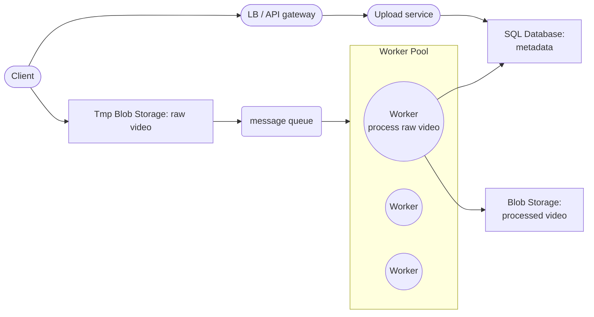
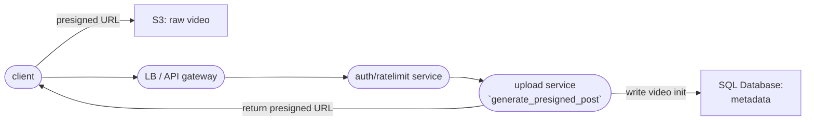
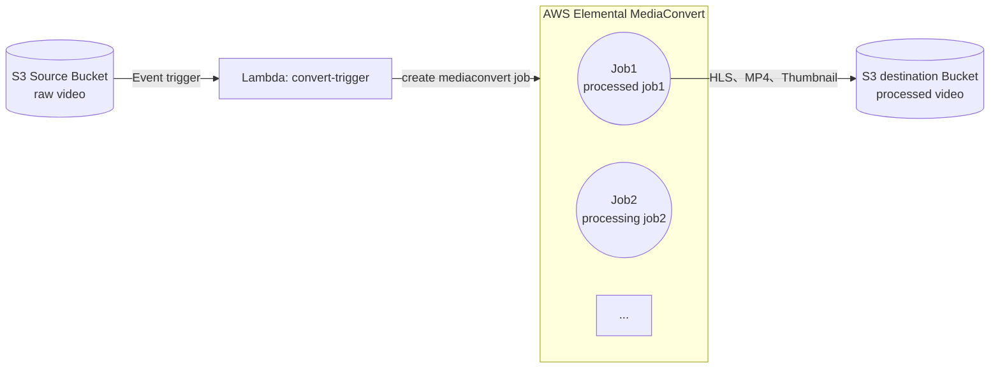
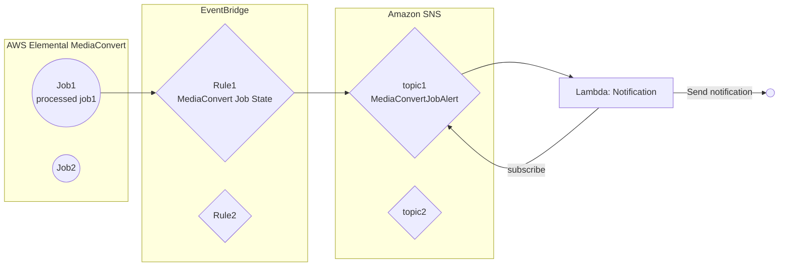
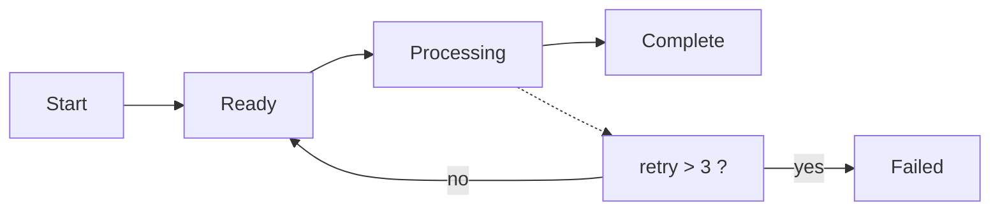
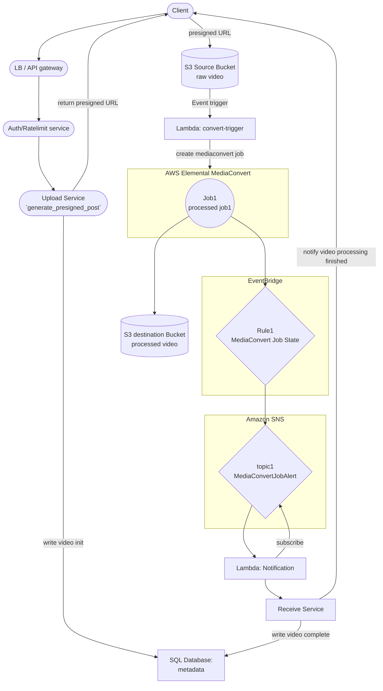

<!--BODY-->
> [前面有討論了 Video Sharing Platform 大概的 Data FlowIn 設計](https://aryido.github.io/posts/video-streaming/backend/)，接著繼續深入「影片上傳」這個部分的細節和實作。並不只是簡單的把檔案藉由後端 server 寫進儲存系統而已，還牽涉到如：
> - **安全性相關** : User 驗證、Data 驗證等等
> - **錯誤處裡**: 上傳網路中斷、資料格式不符、error handling
> - **資料轉換**: 對應需求，可能對資料做前處理或後處理
> - **系統能力**: Latency 或者是否影響 server 穩定
> 
> 應把它視為一條長流程、非同步、且容易受到網路品質影響的工作，而不是單次同步請求，這樣才能面對突發狀況。

<!--more-->
---

在前面的部分得到關於「影片上傳」的 high-level design 如下 : 


接下來針對流程細節再做進一步補充：

#  Upload Flow  上傳影片流程細節
如何處理檔案上傳，現在已經有一些公認的準則了 :
- **最好不要將整個大檔案，直接載入後端伺服器的 memory 中**
- **使用有效期短、作用範圍限定 pre-signed URL 直接把檔案上傳到 Blob storage**
- **為了支援不穩定的連接，上傳操作採用「分段上傳」和「斷點續傳」**

### Client 從 Upload Service 取得 Tmp Blob Storage 的 pre-signed URL 後將影片上傳

這裏規劃一個 Tmp Blob Storage 去存原始 video，例如說使用 AWS S3 創建一個臨時 bucket 將原始影片上傳到這裡儲存，且為了確保安全性 :
- 使用 [presigned URL](https://blog.bitipcman.com/post/s3-presign-url-upload/) 來獲得臨時 object storage 存取權限
- presigned URL 另外還可以設定過期時間，當有效期超過之後，用 url 存取文件會提示 403。

範例如下：
```python
s3_client.generate_presigned_post(
  Bucket=bucket_name,
  Key=key,
  Conditions=[
    ["content-length-range", 0, limit_size_bytes],
    ["Expires", 3600] # 是給 HTTP Expires header，給瀏覽器/CDN 的 cache 到期時間
  ],
  ExpiresIn=expire_after_sec, # 代表 pre-signed URL 上授權可以用多久，url 多久後失效
)
```
pre-signed URL 由後端 Upload Service 來頒發，其設定的參數值 `generate_presigned_post` 函數會做簽名以防篡改。

此外通常 Upload Service 前面會**加一個 auth/ratelimit service 來對做 client 詳細認證**，例如：
- 短時間調用太多次就暫時不給 url
- 要是平台認證會員身份才能拿到 url 


以上做法可以讓 upload 安全性增加不少。


另外**頒發 pre-signed URL 之後也要在 metadata storage 內寫入相關訊息**，代表影片的 init 初始化，主要原因是：pre-signed URL 的頒發本身只代表「後端允許某個 client 直接上傳到 object storage」，**不代表系統內已經正式建立一筆可追蹤的 upload**，先建立 upload 的 init 狀態，**後續整個流程才有一致的可參考點**，後續處理才有依據，也就是 : 
- 狀態管理：可以明確區分 init、done、failed，而不是只看 bucket 裡有沒有檔案
- 安全控制：若 metadata 中沒有對應初始化紀錄，即使 bucket 出現檔案，也可以視為非預期物件，不進行後續流程
- 過期清理：若 URL 已頒發但 client 沒有真的上傳完成，可依 init 紀錄做清理


關於 video metadata 應該用 Relational Database 儲存 ; 還是用 NoSQL 去存呢？

- 使用  Relational Database，就有機會使用 join 的形式去進行跨表的查詢來處理一些資料上的關聯 ; 缺點在於需要自己去維護 data sharding 和 hostspot
- 用 NoSQL 的好處是 data partition 通常是天然支援的，但缺點就是不支援事務性的操作

對於 video metadata 目前看下來以上兩個方案都是可行的，通常實際決定的重點是「**取決於團隊偏好**」，也就是說團隊已經在用的就跟著去用，不需要額外增加技術棧。


---

### 影片完整上傳到 Tmp Blob Storage 之後，Storage 發出 Task Event，然後 Worker 接收到 Event 後會對影片進行處理

這邊提到「**影片完整上傳**」到 Tmp Blob Storage，那所謂的 **完整上傳** 是什麼意思呢？因為考慮到「**上傳影片 Latency**」 問題，故「**上傳的方式**」會有不同手法，例如 :

- ##### Client 把 video 切成小份 chunk 上傳到 Tmp Blob Storage

  例如說 client 把 video 分成每 `2M` 一個 chunk ，那一個約 `20M` 的 video 就有 `10 個 chunk` 需要上傳，這樣的好處是：
  - 可以做到**並行上傳(paralllel upload)**，上傳的速度可以達到蠻好的優化
  - 例如說用戶是使用手機端 App 上傳，這時通常是在 wifi 這種不穩定的網路，所以隨時可能中斷。切分做法下，如果**其中幾個 chunk 失敗了，可以只針對該部分進行重傳**。

  但是缺點是 : 
  - client 要去熟悉影片 chunk 切割相關 lib 操作 ; 最後傳完之後可能會需要有 finish signal 機制，提示影片已經全部上傳完成
  - 這種做法無法達到藉由分析 video 本身的特性，客製化切分段。例如一分鐘影片，前面 30s 動作幅度不大，那可能可以把前面這部分都壓縮成一小塊，然後後面是多動作和特效片段，可以切得更細更多來處理。
    
考慮到 client 端的硬體各式各樣，故實務上不太可能是由 client 端來分析影片的 syntax 特性，然後將 video 按照 syntax 來動態 segment 切分


  - 由於後續可能有要把 chunk 再次合併回一個完整的 video 需求(分割上傳之後在 worker 將多個 segment 合併成原來的完整的 video (記得要做完整性的驗證))，這時要考慮一下之前的分割做法有沒有必要。

  關於切分多個 chunk 操作，有看到 S3 提供了 [CreateMultipartUpload](https://docs.aws.amazon.com/AmazonS3/latest/API/API_CreateMultipartUpload.html) 方法， 可以分段上傳且最後 S3 會直接幫忙合併，但如何和 presigned URL 一起使用需要研究一下。

  
分段上傳和 presigned URL 結合使用可以參考： 
- [Enhancing File Uploads to Amazon S3 Using multi-part with Pre-signed URLs and Threaded Parallelism](https://vsgump.medium.com/enhancing-file-uploads-to-amazon-s3-with-pre-signed-urls-and-threaded-parallelism-23890b9d6c54)
- [Upload large files to AWS S3 using Multipart upload and presigned URLs](https://dev.to/magpys/upload-large-files-to-aws-s3-using-multipart-upload-and-presigned-urls-4olo)



- ##### 直接上傳 video 到 tmp storage

  現在的影片平台，蠻多都有自適應位元速率串流 (Adaptive Bitrate Streaming)的功能，舉例來說：支援自適應位元速率串流的「**HLS 通訊協定**」，其本身就有把影片分割成小的片段，然後使用 `m3u8` 對 segment 管理。所以前面的 「client 把 video 切成小份 chunk 上傳」的方式，更好的是切分方法是直接**基於通訊協定來做**，但這樣 client 實作的難度就更高了。

  
如果是時間很長且容量大的影片，**分割上傳**還是需要的。雖然目前不確定當影片多長多大的時候，用這種「先分割再合併」的方式才會有比較好的效能，可能需要蠻多測試和調查的


  另外這些分割小片段，其實通常還要有**多個不同的解析度**如 480p、720p、1080p 可選，要產生多個解析度影片這件事情，同樣也不太可能是由 client 端負責，應該由後端來做 ; 再加上現在大部分的影音轉檔服務(可以參考 AWS MediaConvert 服務來做影音轉檔)直觀提供的，都是「**給一個完整影片，然後可產出多個指定解析度的分割**」，故 client 不錯任何事情直接上傳 video 其實也是一種做法。

關於 S3 上傳，還可以進一步啟用 [Amazon S3 Transfer Acceleration](https://docs.aws.amazon.com/zh_tw/AmazonS3/latest/userguide/transfer-acceleration.html)，加速 client 網際網路傳輸速度，但[定價方面會多一些 Cost](https://aws.amazon.com/tw/s3/pricing/?nc=sn&loc=4)。
```python
client = boto3.client(
  "s3",
  region_name=region_name,
  aws_access_key_id=access_key_id,
  aws_secret_access_key=secret_access_key,
  config=Config(
      retries={
          "max_attempts": 3,
          "mode": "standard",
      },
      s3={'use_accelerate_endpoint': True}, #  開啟 Transfer Acceleration
  ),
)
```
另外還有特別提到，如果檢查開啟 Transfer Acceleration 服務比一般傳輸慢的話，就不會收取費用，而且會繞過 Transfer Acceleration 系統。

之前有發現 Transfer Acceleration 似乎蠻不穩定的，使用 [Amazon S3 Transfer Acceleration 速度比較工具](https://s3-accelerate-speedtest.s3-accelerate.amazonaws.com/en/accelerate-speed-comparsion.html)來檢查效能，發現沒辦法穩定保持穩定快速...，我想這就是 AWS 特別說「如果沒有比較快就不收費」的原因吧


---

無論是哪個上傳方式，最後當影片完整成功儲存到 S3 之後，都會有[ event 事件發出通知](https://docs.aws.amazon.com/zh_tw/AmazonS3/latest/userguide/enable-event-notifications.html)，從高層設計上，「由 storage 發出 Task Event 給 message queue 中間件，而 worker pool 內的 worker 進行異步處理 queue 內 Task」，前面整個敘述架構為**非同步系統**。

這在實作上有非常多的選擇，這裏就不自己實作了，決定使用現成雲端服務 AWS Elemental MediaConvert，參考 [Tutorial: Batch-transcoding videos with S3 Batch Operations](https://docs.aws.amazon.com/AmazonS3/latest/userguide/tutorial-s3-batchops-lambda-mediaconvert-video.html#batchops-s3-step4) 這個 AWS 官方教學簡介，並再把其架構再進一步簡化，拿掉 S3 batch 組件，則架構和流程就是:




high-level design 的非同步系統的 message queue 和 worker pool，整個實作用 AWS Lambda 和 AWS Elemental MediaConvert 實現


所以流程再下一步就是：

### S3 Source Bucket 發出 Task Event 後，藉由 AWS Elemental MediaConvert 進行影片轉檔，再把結果儲存到 S3 Destination Bucket

這樣的實作下，詳細流程會是：
- `S3 Source Bucket` 發出 Event 後， 由 `Lambda: convert-trigger` 接收
- [`Lambda`](https://github.com/aws-samples/aws-media-services-simple-vod-workflow/blob/master/7-MediaConvertJobLambda/convert.py) 職責是創建 [`MediaConvert job`](https://github.com/aws-samples/aws-media-services-simple-vod-workflow/blob/master/7-MediaConvertJobLambda/job.json) 給 `AWS Elemental MediaConvert` 排程執行
- `AWS Elemental MediaConvert` 根據 job 內容排程執行，轉出設定檔案
- 最後其結果儲存到 `S3 Destination Bucket`



如果不想使用 `AWS Elemental MediaConvert`，就會需要自己研究 FFmpeg，然後架設集群去轉檔，這方面也可以做很多研究。



Netflix 在 2015 年從固定比特率編碼(content-aware encoding)轉向按內容編碼(per-title or per-shot encoding)，在不損失明顯畫質的情況下，頻寬節省高達 20%，缺點是轉碼過程中需要耗費更多時間


---

### 影片處理完存入 S3 Destination Bucket 之後，把完成的消息通知出去

從高層設計上知道影片轉檔是**非同步**觸發的 Encoding pipeline，所以如果沒有實作「**完成轉檔的消息通知**」，client 端**一定不會知道什麼時候影片轉檔完成**，而在上前述架構中，**確定知道是否轉檔成功或失敗的組件**，就是 AWS Elemental MediaConvert 了。

> 那 MediaConvert 組件要怎麼傳送完成或失敗的消息通知給 Client 呢？

可以參考這篇文章 [Using EventBridge with AWS Elemental MediaConvert](https://docs.aws.amazon.com/mediaconvert/latest/ug/eventbridge_events.html)，故還需要新增一些雲端組件 :
- `EventBridge` rule 中定義了 MediaConvert 的事件
- 創建關於 MediaConvert 的事件 `SNS topic`
- 新增 `Lambda` 並訂閱 `SNS topic`
- 轉檔完成會觸發 `Lambda` 

以上架構如下：


影片轉檔完成之後，由於有在 `EventBridge` rule 中定義了 MediaConvert 的事件，當 MediaConvert job 有變動時會送出該事件到指定 `SNS topic` ，然後 `Lambda: Notification` 因為有訂閱該 `SNS topic`，所以觸發了啟動。

為了讓 MediaConvert 轉檔成功的消息能被發出來，這邊又多建立了 EventBridge、SNS topic、Lambda 。有時候使用雲端功能時，實作複雜性也會上升呢


`Lambda: Notification` 要後續的任，是要讓 client 能感知到影片已經處理完了這件事情，在這裡 lambda 可以簡單一點，只做 dispatcher，把任務傳給 `Receive System` 來做。`Receive System` 要做什麼呢？ 主要任務至少要做：
- 轉檔狀態寫入  metadata storage
- 通知 client 端轉檔任務完成


先寫 DB，再發通知，不要反過來。client 收到通知後，最好再 call 一次 status API 確認最終狀態


##### 轉檔狀態寫入  metadata storage
回想一下之前在一開始上傳影片的時候，有提到「頒發 pre-signed URL 後要在 metadata storage 內寫入相關訊息，代表影片的 init 初始化」，而這裡就**需要在 metadata storage 內寫入影片最後轉檔成功/失敗的訊息**。

> 那 metadata table 要更新什麼呢？ 

基本上 table 內應該會儲存 video 的狀態。比如說 :
- client 一開始去調用 upload service，影片狀態設置為 `Init`
- 當影片上傳完整後會發個 signal，這時狀態設置為 `Ready` 且創建 Task 放到 queue 裡面
- Worker 會來領取這個任務，當開始處理時候影片狀態設置為 `Processing` 處理當中
- 處理完後 Worker 最後將 MetaData 改成 `Complete`

進一步可以考慮出錯的情形，例如 Processing 如果失敗了可觸發 Retry，然後把狀態設置回 `Ready` 且重新創建 Task 放到 queue 裡面等著下一次執行 ; 或者多次失敗後要變成 `Failed`，以下是狀態圖：



##### 通知 client 端轉檔任務完成
最後的通知方式也是一個系統設計，簡單可以分成：
- **Polling**: client 定時打 GET /videos/{video_id}/status，雖然最簡單但缺點是不即時，也會多一些 request
- **WebSocket**: client 上傳影片時，要訂閱 video_id
- **SSE**: 標準「伺服器單向通知 client」場景

通常 Client 端可能會有比較多情形會導致連線停掉，所以基本上一定要有 Polling status API 做最後保底其他時候可以靠 WebSocket 和 SSE 來提升體驗。

---

# 架構總結

經過上面很多的討論，最後架構：



---

### 參考資料

- [What is AWS Elemental MediaConvert?](https://docs.aws.amazon.com/mediaconvert/latest/ug/what-is.html)