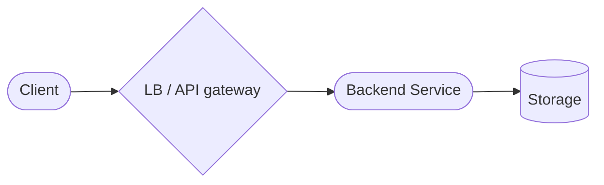
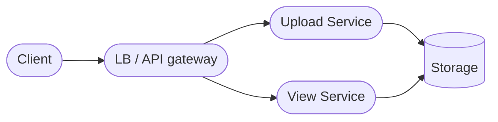
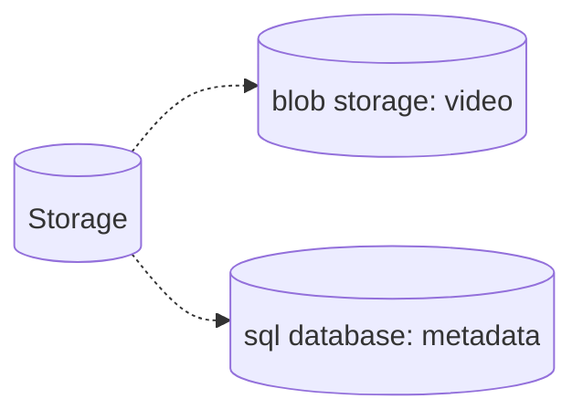
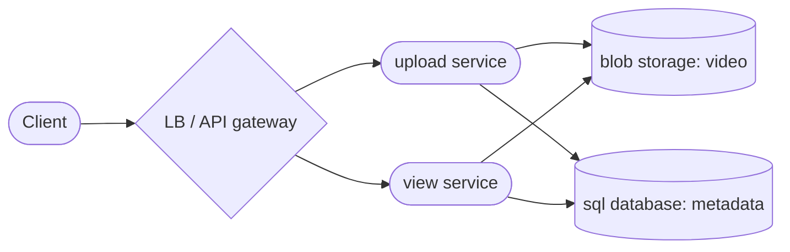
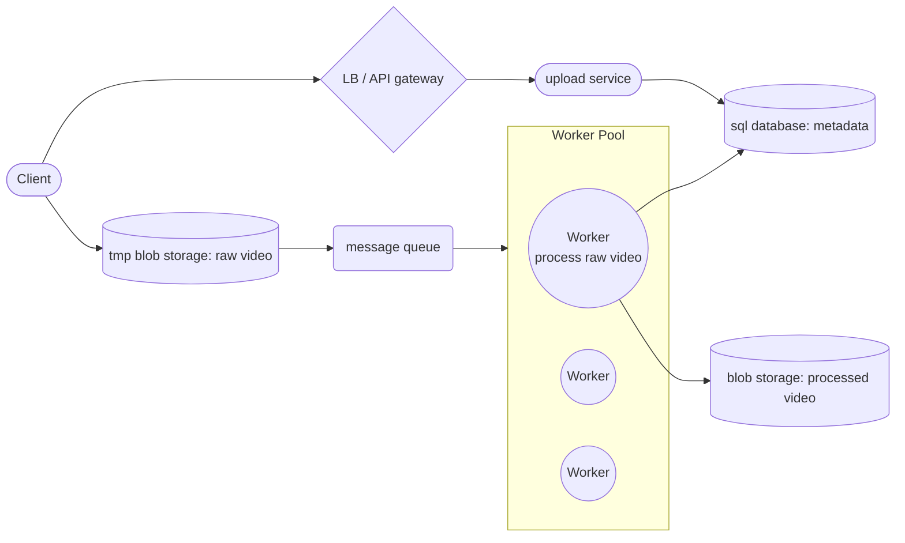
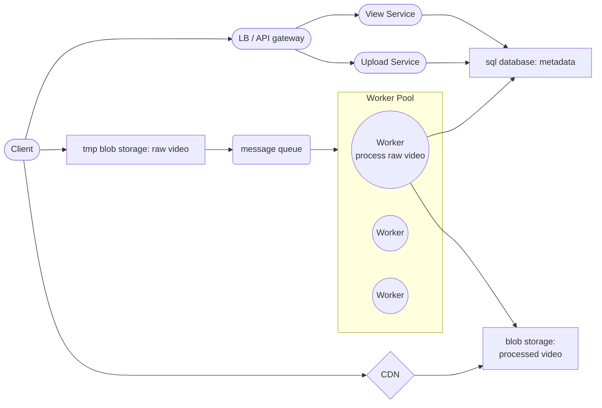

<!--BODY-->
> 如果要 Design 一個 Video Sharing Platform，首先要釐清影片是哪種類型，例如: **短影片(Shorts / Reels / TikTok)**、**長影片(YouTube)**、**直播(Twitch、17LIVE)** 這裡就先選一個比較簡單的「短影片平台」來做範例，而其 Function Requirements 和 Non-Function Requirements 分別就是 :
> - 達成 Data FlowIn/FlowOut 設計，在這裡代表是「 User 可以去上傳自己創作一些 Video 」而「 其他 User 可以去觀看 Video 」
> - 確保有大量 User 使用時系統也要穩定，故有要求 Scalability ; 影片也希望播放順暢，故 latency 要求不能太高
<!--more-->

---

# Estimation

為了規劃需求，首先做一些假設：
- **平台每個月會產生影片數量： `20,000 部 / 月 ~= 666 部 / day`**

  思考一下短影音創作者，能保持日更新是非常厲害的，所以暫時先假設 one video per day 應該是比較合理的，那再來以「20% 的使用者貢獻影片，80％ 單純看影片」來想的話，每天大約有 `666/0.2 = 3330` 個活躍用戶會使用。

- **每天觀看次數：`100,000 次/ day`**
  
思考一下這個數字算合理嗎？ `100,000 /3330 ~= 30 次/ day`，計算後得到 user 一天看 30 次影片，這個數字也算合理


接下來的問題是估算每個影片大概有多，首先假設：

- **單支影片平均長度：30 秒**

  在短影音平台這個假設應該也算是合理的，另外有找一些「常見串流/壓縮後影片」大概對應的流量數值 :

  | 解析度           | Bitrate (H.264)   | MB/s 約值       |
  | --------------- | ----------------- | -------------- |
  | 360p            | 0.5 – 1 Mbps      | 0.06–0.13 MB/s |
  | 480p            | 1 – 2.5 Mbps      | 0.13–0.31 MB/s |
  | 720p (HD)       | 2.5 – 5 Mbps      | 0.31–0.63 MB/s |
  | 1080p (Full HD) | 5 – 8 Mbps        | 0.63–1.00 MB/s |
  | 4K (Ultra HD)   | 15 – 25 Mbps      | 1.88–3.13 MB/s |

  這裡就大概先抓影片流量是 `0.75 MB/s = 6 Mbps`，故每個影片平均大小 `30*0.75 = 22.5 MB`。
  
暫時先用上面的數值往下推估吧，因為影片的大小其實標準差真的蠻大的，例如實際看自己手機隨便幾個影片的例子：
- `720p H264 30fps 30 秒 6MB`
- `1080p HEVC 30fps 30 秒 32MB`
- `4K HEVC 60fps 30 秒 412MB`



# High-Level Architecture Design

先從最萬用的基礎的架構開始


前面章節有簡單把系統設計的類型分成幾類，而設計 Video Sharing Platform 就屬於經典的 Data FlowIn/FlowOut 類型問題，主要需求是考慮怎麼樣把**資料傳進來儲存**然後**要怎麼讀資料** :

### Service 
可以把 backend service 對應 Data flow 部分做細項拆分 : 「FlowIn 功能 Upload Video」 和 
 「FlowOut 功能 View Video」



拆開成 upload service 和 view service 這個動作就把 Workload Isolation 了，讓這兩個**無狀態服務 service** 可以獨立的 scale up ，並根據當前的負載，動態調整自身該承擔的流量，個別進行系統的擴容而不會互相影響。


前面章節有提到，若想要 scale up 一個系統，主要就是: 資料分區、功能分區、增加副本，而上面的做法對應了**功能分區**


### Storage
要儲存的資料有:「**影片本身**」例如該視訊音頻和「**影片元資料**」比如說: video_id 、上傳影片的 user_id 、影片時長、上傳時間點、縮圖資訊、影片 Tag 等等，由於這兩種是完全不同類型的資料，分開成兩種不同的 storage 是必要的。



關於 video metadata 的存儲，應該用 Relational Database 儲存 ; 還是用 NoSQL 去存呢？對於 video metadata 的存儲目前看下來以上兩個方案都是可行的，通常實際決定的重點是「**取決於團隊偏好**」，也就是說團隊已經在用的就跟著去用，不需要額外增加技術棧。比較需要討論的是video 本身的存儲：

##### 關於 video 本身的存儲
最常用的方案是 Blob Storage，而不是 File Storage，其核心原因有幾個：
- 影片檔通常數量很多，而 Blob Storage 天生就是拿來存大量非結構化物件（unstructured objects），擴充容量時不用在意如 File Storage 需要注意的目錄結構、掛載點、單台機器磁碟上限等等問題

- 通常不會有多人同時編輯影片的需求，故太需要 File Storage 檔案鎖功能

- 影片通常需要 CDN 分發，而 blob storage 可直接作為 origin，提供穩定 URL、metadata、cache control 等等，對串流和下載都很方便

- 上傳影片後，常會需要觸發轉碼（transcoding）、製造縮圖（thumbnail）等等功能，而 blob storage 很容易串上事件通知，讓後續 pipeline 執行任務


file storage 比較適合情況如 : 多台機器需要共享同一套檔案樹、需頻繁覆寫、append、檔案鎖，但影片最常見的需求是「存很多、讀很多、很少修改」。
- blob storage 當成「成品倉庫」
- file storage 當成「共用的工作區」

通常會是：原始影片、轉碼後影片、縮圖放 blob storage ; 轉碼工作節點暫存中間檔時，才用本機磁碟或 file storage


### 通用架構整理
承上面 service 和 storage 分析，我們可以得到簡單的 high-level design：

目前這樣的架構還有一些問題和事情要解決：
> - User 故意傳超長時間、容量超大的影片時要擋下來，不應該存入 storage
> - 影片應該要限制某些格式才能順利播放，故要做 type 檢查
> - 要注意不合規如：成人影片、版權問題、或者惡意病毒會導致 server 問題的影片
> - 額外的一些事情如： **影片上傳的 latency**  ; 影片有**自適應位元速率串流 (Adaptive Bitrate Streaming)要求**，這些可能都還要另外再對影片做一些額外處理
> - 若大量 User 看影片，都直接利用 view service 去拿 blob storage 來播放影片的話，**播放 latency** 問題

以下還接著更細部的討論。

---

# Detail Deep dive

### Upload Service
上傳影片屬於 Data Flow In 問題，這種主要需思考兩個重要的主題：
- 大型檔案上傳
- 資料是否安全

目前設計上直接呼叫 Upload Service 而沒有任何把控是危險的。如果還要做一些影片處理工作，還要考慮到 latency ，若是全部交由 Upload Service 直接執行檢查或和處理流程完成才回覆給 client ，必定會很慢 ; 再加上如果檔案太大上傳至 server 會直接造成系統風險。

解決方法上，因為不能直接傳到後端 server ，故要先規劃一個「**臨時的儲存空間去存原始 video**」，然後另外使用「**非同步**」方式，讓 Worker 去執行一些基礎的檢查和轉換流程，最後才把合規的影片，儲存到真的 blob storage 內。非同步架構下通常需要一個 message queue 來管理 video 處理任務，而 Worker Pool 可根據 queue 裡面囤積的 Task 數量，動態再去調整 Worker 數量。 

以下先專注在 upload 的架構 : 

當 video 完整上傳到 tmp blob storage 之後，storage 會產生一個 task event 放到 message queue 內，然後 task event 會分配給一個 worker 對 video 進行處理，最後 worker 把處理完成的影片放到後端真正的 blob storage 內，同時也要把相關紀錄寫到 metadata sql database。

### View Service

最簡單直覺的方法就是使用者去呼叫 view service，然後去 DB 讀一下 video metadata 然後把找到的 video_id 返回，最後 client 在用這些 video_id 去 blob storage 拿取影片播放。這種 Data FlowOut 問題，主要都要考慮一下 latency ，而這裏會是強調「影片播放 latency」該怎麼優化呢？

##### 引入 CDN

主流優化方案是引入 CDN，雖然可顯著降低 latency，但會產生額外的 cost 上升。

考慮到 CDN 花費問題，應該會希望 CDN 裡的 video 盡量是熱門影片，做法可以是：
- 設定 cdn 過期 rule 的策略，例如說如果經常被請求的話，就把過期時間延後 ; 冷門的就自然刪除
- 進一步還可以另外做個 Extractor Service，它可定期的去從 Blob Storage 裡把熱門影片找出來推送到 CDN 裡。
  ```mermaid
  flowchart LR
      client([Client]) --- |return video_id| gateway([LB / API gateway])
      client --> cdn{CDN}
      gateway --- view([View Service])
      view --- metadata_storage[(sql database: metadata)]
      extractor([Extractor Service]) --> cdn
      extractor([Extractor Service]) --> blob_storage[(blob storage: processed video)]
  ```
  
Extractor 還可以套用一些 ML 模型來計算熱門影片，甚至做出推薦系統

  

##### 使用串流媒體協議
通常在看影片時，點擊 video 後馬上就開始播放了，不需要等到整個下載完，這裡就引出 streaming protocol 的使用。要讓影片支持  streaming protocol 這部份通常是：
- 使用者上傳時，影片本身就已經支持協議的格式了
- 影片上傳後，後端要有組件去做轉檔

這樣才能在播放影片時利用 streaming protocol 使得播放更順暢。

---

# 結論
回到估算來思考，依照 `20,000 部 / 月` 來看的話，這邊引入 extractor service 可能太早了。依照 80/20 法則，大概其中比較熱門影片才 4000 部，要到整個月都熱門的情況應該是 1/1000 ; 周熱門 1/100， 故直接在 CDN rule 上設定可能 2 小時沒人看就自動過期，應該就可以解決大部分的情況。

另外因為是短影片，



---

### 參考資料

- [system design - design tiktok](https://www.youtube.com/watch?v=rp2vjxwHJgc)
